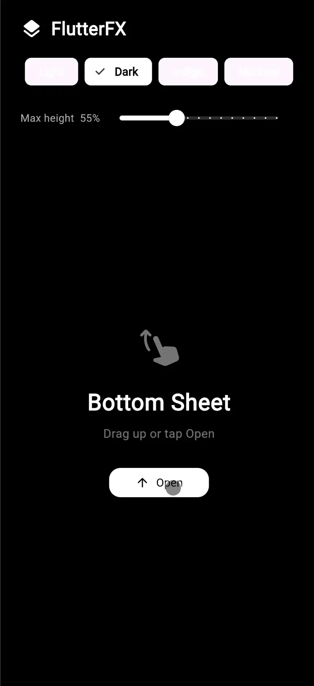

# flutterfx_bottom_sheet

A Flutter bottom sheet widget with a smooth **scale-and-slide** entrance animation, drag-to-dismiss, and a fully customisable style system. Part of the [FlutterFX](https://flutterfx.com) collection.



---

## Features

- Scale + slide animation on the main content when the sheet opens
- Drag-to-dismiss with velocity-aware snapping
- `FxBottomSheetController` for programmatic `open()` / `close()` / `toggle()`
- `FxBottomSheetStyle` with `light()` and `dark()` presets plus `copyWith()`
- Zero external dependencies — Flutter SDK only

---

## Installation

```yaml
dependencies:
  flutterfx_bottom_sheet: ^1.0.0
```

---

## Basic usage

```dart
import 'package:flutterfx_bottom_sheet/flutterfx_bottom_sheet.dart';

class MyPage extends StatefulWidget {
  const MyPage({super.key});
  @override
  State<MyPage> createState() => _MyPageState();
}

class _MyPageState extends State<MyPage> {
  final _controller = FxBottomSheetController();

  @override
  Widget build(BuildContext context) {
    return Scaffold(
      body: SafeArea(
        bottom: false,
        child: FxBottomSheet(
          controller: _controller,
          mainContent: _MyMainScreen(onOpen: _controller.open),
          drawerContent: const _MySheetContent(),
        ),
      ),
    );
  }
}
```

---

## Customisation

### Presets

```dart
// Light (default)
FxBottomSheet(style: FxBottomSheetStyle.light(), ...)

// Dark
FxBottomSheet(style: FxBottomSheetStyle.dark(), ...)
```

### Fine-tuning with copyWith

```dart
FxBottomSheet(
  style: FxBottomSheetStyle.dark().copyWith(
    topBorderRadius: 28,
    mainContentScale: 0.90,   // less dramatic scale
    mainContentSlide: 16,     // less upward slide
  ),
  maxHeight: 0.75,            // sheet takes 75% of screen height
  ...
)
```

### Full parameter list

| Parameter | Type | Default | Description |
|---|---|---|---|
| `mainContent` | `Widget` | required | Content rendered behind the sheet |
| `drawerContent` | `Widget` | required | Content inside the sheet |
| `controller` | `FxBottomSheetController?` | — | Programmatic control |
| `maxHeight` | `double` | `0.90` | Fractional height when fully open |
| `minHeight` | `double` | `0.0` | Fractional height when closed |
| `animationDuration` | `Duration` | `300 ms` | Open/close speed |
| `style` | `FxBottomSheetStyle` | light preset | Visual configuration |

### FxBottomSheetStyle fields

| Field | Description |
|---|---|
| `backgroundColor` | Sheet panel background |
| `barrierColor` | Dimming overlay colour |
| `handleColor` | Drag handle pill colour |
| `handleWidth` / `handleHeight` | Handle pill dimensions |
| `topBorderRadius` | Top-edge corner radius |
| `boxShadow` | Shadow on the sheet panel |
| `mainContentScale` | Scale target for main content (0.85 default) |
| `mainContentSlide` | Upward slide in pixels (24 default) |

---

## FxBottomSheetController

```dart
final controller = FxBottomSheetController();

controller.open();    // slide sheet up
controller.close();   // slide sheet down
controller.toggle();  // open if closed, close if open
controller.isOpen;    // bool getter

// dispose when your widget is disposed
@override
void dispose() {
  controller.dispose();
  super.dispose();
}
```

---

## Part of FlutterFX

Visit [flutterfx.com](https://flutterfx.com) for the full widget catalogue.
